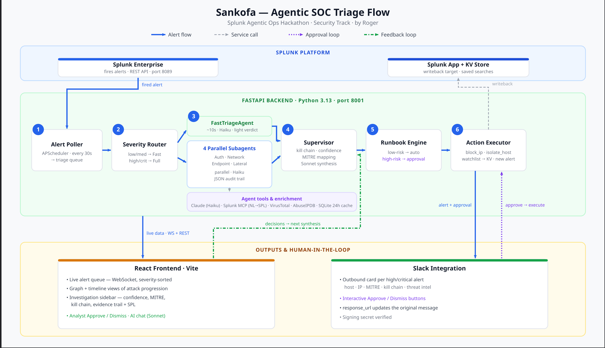

# Sankofa — Agentic SOC Triage for Splunk

> *"Go back and get it"* — learn from past threats to protect the future.

**Sankofa** is an autonomous security operations platform that sits between Splunk and your analysts. When an alert fires, Sankofa investigates it — querying four dimensions of Splunk data in parallel, enriching threat intelligence, executing runbook actions autonomously, and routing high-risk decisions to analysts via Slack — so your team only touches what actually matters.

Built for the **Splunk Agentic Ops Hackathon** · Security Track · by Roger

---



---

## The Problem

A typical SOC analyst faces two compounding problems:

1. **Alert volume** — hundreds of alerts per shift, most of which are noise
2. **Investigation toil** — each credible alert requires 20–40 minutes of manual SPL queries, cross-referencing logs, looking up IPs, and building a timeline before a single decision can be made

Sankofa eliminates the toil. Alert fires → Sankofa investigates → Sankofa acts → analyst confirms or overrides.

---

## What It Does

### Tiered Multi-Agent Triage

Every alert is classified on arrival:

- **Low/Medium** → `FastTriageAgent`: a single Claude Haiku call scores severity 1–10, maps to MITRE ATT&CK, and writes a two-sentence summary. Completes in ~10 seconds.
- **High/Critical** → four specialized subagents run in **parallel**, each querying a different dimension of Splunk data:

| Agent | Sourcetypes | What it hunts |
|---|---|---|
| **Auth Agent** | `WinEventLog:Security`, `linux_secure` | Failed logins, lockouts, unusual logon types |
| **Network Agent** | `firewall`, `pan:traffic`, `cisco:asa` | Port scans, unusual destinations, high-volume connections |
| **Endpoint Agent** | `sysmon`, `osquery`, `WinEventLog:System` | Suspicious processes, PowerShell execution, file writes |
| **Lateral Agent** | `WinEventLog:Security` (EventCode 4648/4624) | SMB pivots, PsExec, WMI remote calls |

Each subagent uses the **Splunk MCP Server** (`generate_spl` tool) to convert a natural-language question into SPL before running the search. The MCP-generated query is shown in the UI with a purple **MCP** badge — fully auditable. A supervisor then synthesizes all four findings into a kill chain, confidence score (0–100), MITRE tactic, and containment steps.

### Autonomous Runbook Execution

After triage, the runbook engine matches the alert to a playbook by MITRE tactic and severity. Three defaults ship out of the box:

| Runbook | Trigger | Steps |
|---|---|---|
| Credential Access Response | TA0006 + high/critical | Add IP to watchlist → Create Splunk alert → **Block IP** *(approval required)* |
| Lateral Movement Response | TA0008 + high/critical | Add IP to watchlist → **Isolate host** *(approval required)* |
| Reconnaissance Response | TA0043 + medium+ | Add IP to watchlist → Notify Slack |

Low-risk steps execute automatically and confirm in Slack. High-risk steps post an **Approve / Dismiss** card and wait.

### Slack Integration

Every high/critical alert triggers a rich Slack card:

```
🔴 CRITICAL — Credential Dumping — LSASS Memory Access
Host: win-dc01 | IP: 185.220.101.42
MITRE: TA0006 - Credential Access | Confidence: 87%
Kill chain: Port Scan → Brute Force → LSASS Access
⚠️ Threat Intel: Known Tor exit node (847 AbuseIPDB reports)
[View in Sankofa]  [Mark False Positive]
```

High-risk runbook steps post interactive approval cards. Button clicks are verified with HMAC-SHA256 signature checking and update the original Slack message using `response_url`.

### Threat Intelligence Enrichment

Source IPs are automatically enriched against VirusTotal and AbuseIPDB (with 24-hour SQLite caching). If an IP has a reputation score > 50 or > 10 abuse reports, the enrichment panel auto-expands in the investigation sidebar showing score, abuse count, country, ASN, malware families, and Tor exit node status. This context feeds directly into the synthesis prompt.

### Feedback Loop

Every analyst decision — approve, dismiss, mark false positive — is stored as a structured feedback entry. Future synthesis prompts for the same IP, host, or attack pattern include the decision history. The system gets more accurate with every shift.

### Live Dashboard

- **Graph View**: D3 force-directed network diagram. The primary attacker IP dominates visually with directed attack path arrows. Stable across WebSocket updates (only rebuilds when alert IDs change, not on status updates). Zoom, drag, click to investigate.
- **Timeline View**: horizontal swimlane by severity showing the attack campaign unfolding chronologically
- **Investigation Sidebar**: severity score bar, confidence meter, MITRE chip, kill chain timeline, collapsible Evidence Trail (with SPL queries and MCP badges), threat intel panel, containment action approval gate, streaming AI chat
- **Action Log**: slide-in panel showing every autonomous action taken with status, timestamp, and result
- **Stats Bar**: live severity counts, average confidence, actions executed, pending approvals

---

## Architecture

```
Splunk Enterprise ──── REST API ──────────────────────────────────┐
Splunk MCP Server ──── generate_spl ──────────────────────────────┤
VirusTotal / AbuseIPDB ────────────────────────────────────────────┤
Anthropic Claude (Haiku + Sonnet) ─────────────────────────────────┤
                                                                    ▼
                           ┌──────────────────────────────────────────┐
                           │            FastAPI Backend               │
                           │  ┌──────────┐  ┌─────────────────────┐  │
                           │  │  Alert   │  │    Triage Engine     │  │
                           │  │  Poller  │  │  ┌────┐ ┌────┐      │  │
                           │  │  30s     │  │  │Auth│ │Net │ ┌──┐ │  │
                           │  └──────────┘  │  └────┘ └────┘ │EP│ │  │
                           │               │  ┌────┐ ┌────┐  └──┘ │  │
                           │               │  │Lat │ │Sup │       │  │
                           │               │  └────┘ └────┘       │  │
                           │               └─────────────────────┘  │
                           │  ┌──────────┐  ┌──────────┐            │
                           │  │ Runbook  │  │ Action   │            │
                           │  │ Engine   │  │ Executor │            │
                           │  └──────────┘  └──────────┘            │
                           │  ┌──────────┐  ┌──────────┐            │
                           │  │Enrichment│  │ Feedback │            │
                           │  └──────────┘  │  Loop    │            │
                           │                └──────────┘            │
                           └──────────┬───────────────┬─────────────┘
                                      │               │
                          ┌───────────┘               └──────────────┐
                          ▼                                           ▼
             ┌─────────────────────┐                    ┌────────────────────┐
             │    React Frontend   │                    │       Slack        │
             │  Graph · Timeline   │                    │  Alert cards       │
             │  Investigation      │                    │  Approve/Dismiss   │
             │  Action Log · Chat  │                    │  Confirmations     │
             └─────────────────────┘                    └────────────────────┘
```

---

## Tech Stack

| Layer | Technology |
|---|---|
| Backend | FastAPI + Python 3.13 |
| Splunk | `splunk-sdk-python` (develop branch), `splunklib.ai`, REST API, scheme=https |
| MCP | Splunk MCP Server v1.2.0 (Splunkbase App 7931) |
| LLM | Anthropic Claude — Haiku (subagents, speed) · Sonnet (chat synthesis) |
| Enrichment | VirusTotal API v3 · AbuseIPDB API v2 |
| Database | SQLite via `aiosqlite` (WAL mode) |
| Scheduler | APScheduler |
| Notifications | Slack Incoming Webhooks + Interactivity API |
| Frontend | React 18 + Vite + Tailwind CSS + Zustand + Framer Motion + D3 v7 |

---

## Setup

### Prerequisites

- Python 3.13
- Node.js 18+
- Splunk Enterprise (free 60-day trial works)
- Splunk MCP Server app installed (Splunkbase App 7931)
- Anthropic API key

### 1. Clone

```bash
git clone https://github.com/rogerkorantenng/sankofa
cd sankofa
```

### 2. Environment

```bash
cp .env.example backend/.env
```

Edit `backend/.env`:

```env
SPLUNK_HOST=localhost
SPLUNK_PORT=8089
SPLUNK_TOKEN=<your_splunk_token>        # Settings → Tokens → New Token
ANTHROPIC_API_KEY=<your_key>
SLACK_WEBHOOK_URL=<optional>            # Incoming Webhook URL
SLACK_SIGNING_SECRET=<optional>         # From Slack App → Basic Information
VIRUSTOTAL_API_KEY=<optional>           # Free tier works
ABUSEIPDB_API_KEY=<optional>            # Free tier works
POLL_INTERVAL_SECONDS=30
DB_PATH=sankofa.db
```

> **Splunk token note:** create the token in Splunk Web with no `not_before` date set. The token must be used with `scheme=https`.

### 3. Backend

```bash
cd backend
python3.13 -m venv venv
source venv/bin/activate
pip install -r requirements.txt
uvicorn main:app --reload --port 8001
```

### 4. Frontend

```bash
cd frontend
npm install
npm run dev
```

Open **http://localhost:5173**

### 5. Load demo data

Click **Load Campaign** in the dashboard to seed a realistic 5-alert attack campaign (port scan → brute force → credential dumping → lateral movement → C2 beacon) and watch the full triage pipeline run live.

### 6. Slack interactive buttons (optional)

To enable Approve/Dismiss from Slack:

```bash
ngrok http 8001
```

In your Slack app settings → **Interactivity & Shortcuts** → set Request URL to `https://<your-ngrok-url>/slack/action`.

---

## Splunk App

Install `sankofa.spl` via **Apps → Manage Apps → Install from file** to add:

- 4 scheduled detection searches (Brute Force, Lateral Movement, LSASS Access, C2 Beacon)
- Dashboard Studio v2 dashboard showing live alert counts and severity distribution

---

## Demo Campaign

The `seed/campaign_alerts.json` file contains a connected 5-alert attack narrative:

| Step | Alert | Severity |
|---|---|---|
| 1 | Reconnaissance — Port Scan from External IP | Low |
| 2 | Credential Access — Brute Force Against Administrator | Medium |
| 3 | Credential Dumping — LSASS Memory Access on Domain Controller | **Critical** |
| 4 | Lateral Movement — SMB Connection to Finance Server | High |
| 5 | C2 Beacon — Suspicious Outbound HTTPS to Rare External IP | High |

---

## Project Structure

```
sankofa/
├── backend/
│   ├── main.py                 # FastAPI app, lifespan, router registration
│   ├── config.py               # Settings from .env
│   ├── database.py             # SQLite schema, WAL mode, all DB helpers
│   ├── models.py               # Pydantic models for all entities
│   ├── poller.py               # APScheduler alert polling
│   ├── enrichment.py           # VirusTotal + AbuseIPDB with caching
│   ├── runbook_engine.py       # Runbook matching and execution
│   ├── action_executor.py      # Low/high-risk action routing
│   ├── slack_webhook.py        # Outbound cards + signature verification
│   ├── mcp_client.py           # Splunk MCP Server client
│   ├── splunk_client.py        # splunklib wrapper
│   ├── triage/
│   │   ├── engine.py           # Supervisor: route → investigate → synthesize
│   │   ├── subagents.py        # 4 parallel subagents with MCP
│   │   └── fast_triage.py      # Fast path for low/medium alerts
│   └── routes/
│       ├── alerts.py           # Alert CRUD + seed endpoints
│       ├── runbooks.py         # Runbook CRUD
│       ├── action_log.py       # Action log + stats
│       ├── slack.py            # Slack inbound webhook
│       └── ws.py               # WebSocket live alert feed
├── frontend/src/
│   ├── components/
│   │   ├── AlertQueue.tsx      # Left panel — live sorted alert list
│   │   ├── GraphView.tsx       # D3 force-directed threat graph
│   │   ├── TimelineView.tsx    # Horizontal severity swimlane
│   │   ├── InvestigationSidebar.tsx  # Slide-in investigation panel
│   │   ├── ReportCard.tsx      # Score, MITRE, kill chain, actions
│   │   ├── AuditTrail.tsx      # Evidence trail with SPL + MCP badges
│   │   ├── EnrichmentPanel.tsx # Threat intel cards
│   │   ├── ChatPanel.tsx       # Streaming AI analyst chat
│   │   └── ActionLog.tsx       # Global action log panel
│   └── pages/
│       ├── Runbooks.tsx        # Runbook list
│       └── RunbookBuilder.tsx  # Zapier-style runbook builder
├── seed/
│   ├── campaign_alerts.json    # 5-alert connected attack campaign
│   └── bots_alerts.json        # Individual BOTS-style test alerts
├── splunk_app/                 # Splunk app package source
├── sankofa.spl                 # Installable Splunk app
├── architecture.svg            # Full system architecture diagram
└── tests/                      # pytest test suite (37 tests)
```

---

## License

Apache 2.0 — see [LICENSE](LICENSE)
